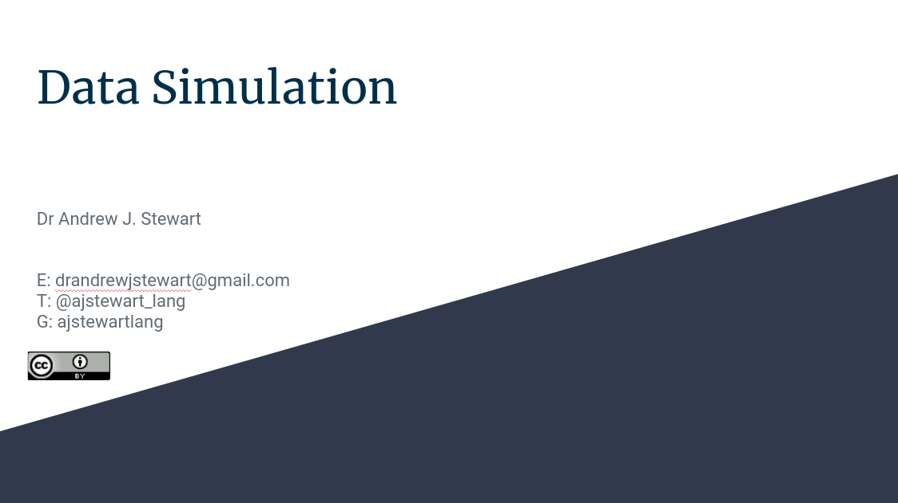

```{r setup, include=FALSE}
knitr::opts_chunk$set(echo = TRUE)
```

# Overview 

&nbsp;&nbsp;

[video 1 here]

&nbsp;&nbsp;

## Slides

You can download the slides in .odp format by clicking [here](../slides/data_sim.odp) and in .pdf format by clicking on the image below. 

&nbsp;&nbsp;

<center>

[{width=75%}](../slides/data_sim.pdf)

</center>

&nbsp;&nbsp;

Once you've watched the video above, run the code below on your own machines.


## Improve this Workshop

If you spot any issues/errors in this workshop, you can raise an issue or create a pull request for [this repo](https://github.com/ajstewartlang/17_data_sim). 